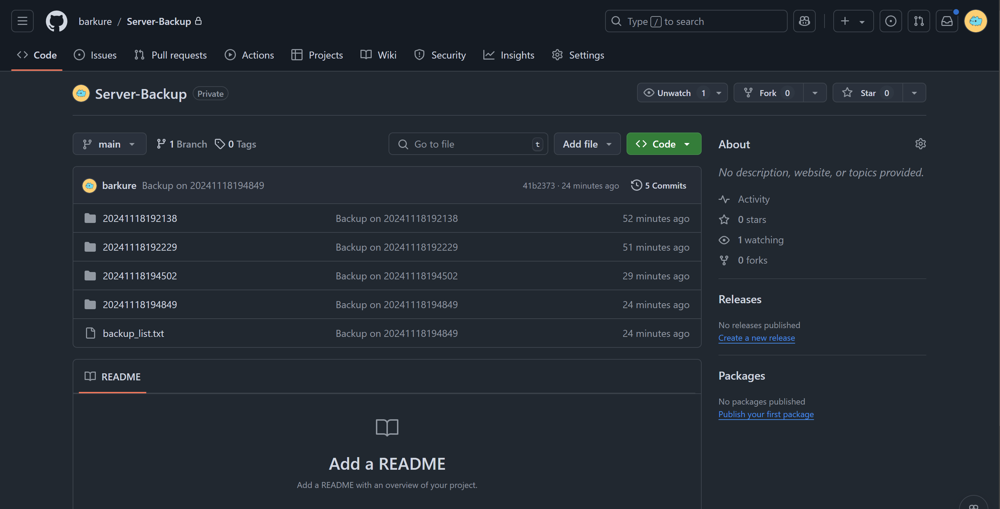
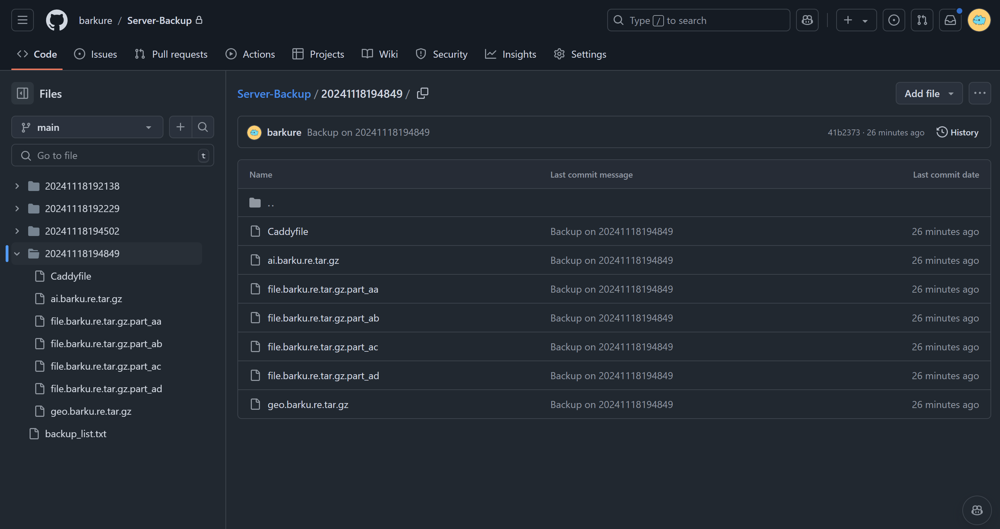

## Auto-Backup-Server
自动备份服务器配置（目录/文件）到 GitHub 仓库。

## 怎么用
### 准备工作
1. 首先确保你的服务器可以通过 SSH 连接到 GitHub；

2. 你需要有个仓库来存放备份的文件，你可以：
    - [创建一个新仓库](https://repo.new)
    - 使用已有仓库（备份前会拉取一遍的）

### 设置自动备份
#### 1. 克隆本仓库并进入：

```bash
git clone https://github.com/barkure/Auto-Backup-Server.git

cd Auto-Backup-Server
```

我克隆到了 `\root\scripts` 目录下，因此后面有些路径请修改为你自己的。

#### 2. 修改 `config.py` 为自己的参数，下面的是我的例子：

```python
# 需要备份的目录（文件）
backup_dir = [
    "/var/www/geo.barku.re",
    "/var/www/file.barku.re",
    "/var/www/ai.barku.re",
    "/etc/caddy/Caddyfile",
]

# GitHub 仓库
repo = "barkure/Server-Backup"

# 文件大小限制（例如 100MB）
FILE_SIZE_LIMIT = 100 * 1024 * 1024

# 保留的备份次数，超过此次数则删除最旧的备份
MAX_BACKUPS = 30
```

#### 3. 测试一下：

```python
python3 backup.py
```
运行结束后去 GitHub 对应仓库看一下有没有新的提交，可以的话进行下一步。

#### 4. 设置定时任务：

```bash
crontab -e
```

加入下面的内容并保存：

```bash
0 5 * * * /usr/bin/python3 /root/scripts/Auto-Backup-Server/backup.py
```

注意，你可能需要了解 **crontab** 的使用方法，上面的意思是每天早上 5 点整会运行一次备份脚本。

## 截图示例
|多次备份|大文件分割|
|:---:|:---:|
|||